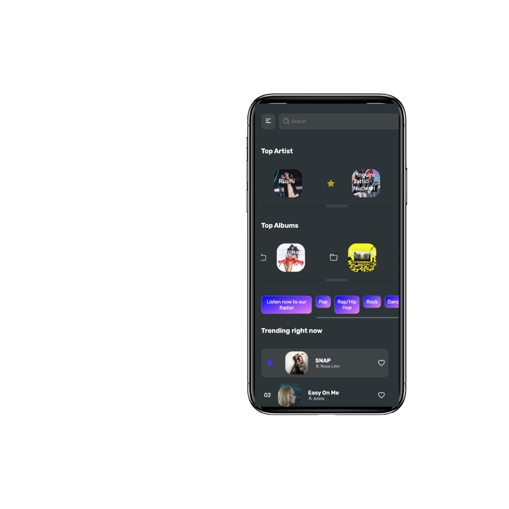

<body>

      

  

</h1>  

 

  <h3 align="left">Descrizione</h3>
    
 <a style="color:#3a54ed" > Budz </a> rappresenta un'opportunità di ampliare i propri orizzonti musicali attraverso una vasta gamma di contenuti coinvolgenti e facilmente raggiungibili.

   
 È una web App con focus sul front-end, basata su l'API di <a style='color: #3a54ed; text-decoration: none'href='https://developers.deezer.com/login?redirect=/api'     target='_blank' >DEEZER</a>, sviluppata utilizzando il framework Next.js e il preprocessore SASS. 
    
      Attraverso un'attenta analisi delle svariate piattaforme di streaming audio siamo giunti ad una sintesi di User Experience che potesse garantire agli utenti l'esperienza più immersiva possibile. 
    

     
    
<b>Credenziali Login</b>

    <ul>
    <li><b>user</b>: admin</li>
     <li> <b>pass</b>: cb6</li>
    </ul>

          

    <h3 align="left">Home in versione mobile e desktop</h3>
  

    
  

      
      

      

    <h3 align="left">Routing</h3>
    
  
L'uso di  Next.js fornisce un'esperienza di navigazione fluida e veloce. Per garantire un caricamento rapido delle pagine e una migliore indicizzazione sui motori di ricerca, è stato utilizzato il  server-side rendering, che permette di generare le pagine HTML lato server prima di inviarle al client.  

  

    
     

      

<h3>Tecnologie :</h3>
<ul style="display: flex; flex-direction: row; gap:20px; align-items: center; justify-content: flex-start;">

</ul>

<h3 align="left">Design</h3>
 
Il design dell'applicazione è stato realizzato prendendo spunto da Dribble e modificata secondo i nostri gusti partendo dalla creazione di un mock up su Figma. L'utilizzo di  SASS ha semplificato la scrittura del codice CSS. Sono stati utilizzati i  moduli SCSS, tecnologia che consente di organizzare lo stile in file separati, semplificando la manutenzione e il debugging del codice.
  
 

  
        

    <h3 align="left">Struttura</h3>
  
L'applicazione presenta una pagina di login per accedere all'account dell'utente e una homepage che mostra i migliori artisti, le migliori tracce e i migliori album del momento. Cliccando su ogni singolo elemento, si aprirà una pagina dinamica con le informazioni dettagliate e la possibilità di ascoltare la traccia audio. 

  

   
  

 

Inoltre, il progetto include: 

<ul style="padding: 0px; text-align: left;">
        <li> una pagina "Track", che consente agli utenti di azionare e interrompere la canzone, visionare il video Youtube relativo alla traccia.</li>
        <li> tre pagine  dedicate alla gestione delle canzoni, album e artisti preferiti, in cui gli utenti cliccando sull' icona corrispondente, possono aggiungere e rimuovere il contenuto.</li>
        <li> una pagina "shuffle" che mostra all'utente una selezione randomica di brani anch'esse riproducibili</li>
        <li> una pagina adibita alla ricerca di album, artisti o canzoni specifici</li>
        <li> una pagina dedicata ai generi musicali, in cui è possibile selezionare il genere scelto e ascoltarlo</li>
       <li> una pagina "About", con i nomi e le informazioni relative ai partecipanti del progetto</li>
        <li> una pagina "404", per gli errori</li>
        <li> un pulsante di logout</li>
    </ul> 
  

 

   

      
   

      <h3>Team Budz</h3>
     

       Questo progetto è stato realizzato in due settimane da un gruppo di studenti durante il coding bootcamp 6 di Edgemony, utilizzando una metodologia Agile Scrum. Il team ha lavorato insieme in modo collaborativo e altamente organizzato, tenendo incontri regolari per monitorare il progresso del lavoro e identificare eventuali ostacoli fino al completamento del progetto. Grazie a questa metodologia, il team ha lavorato in modo efficiente e concentrato sui compiti più importanti per il successo del progetto.
     

      <ul style="list-style-type: none; padding: 0px; text-align: center;">
        <li>Ilenia Ingrassia:  <a href="https://www.linkedin.com/in/ilenia-ingrassia-a43a7019a/"  target="_blank">LinkedIn</a>,  <a href="https://github.com/ileniai"  target="_blank">GitHub</a></li>
        <li>Luisa Zizzo:  <a href="linkedin.com/in/luisa-zizzo"  target="_blank">LinkedIn</a>,  <a href="https://github.com/Luisazizzo"  target="_blank">GitHub</a></li>
        <li>Alessio Perez:  <a href="linkedin.com/in/alessio-perez"  target="_blank">LinkedIn</a>,  <a href="https://github.com/alekyari"  target="_blank">GitHub</a></li>
        <li>Adriana Origlio:  <a href="linkedin.com/in/adriana-origlio"  target="_blank">LinkedIn</a>,  <a href="https://github.com/chibiusagitsukino"  target="_blank">GitHub</a></li>
        <li>Fabio Massi:  <a href="linkedin.com/in/fabio-massi-7b755112a"  target="_blank">LinkedIn</a>, <a href="https://github.com/timcrocodile"  target="_blank">GitHub</a></li>
      </ul>
    

  </body>
